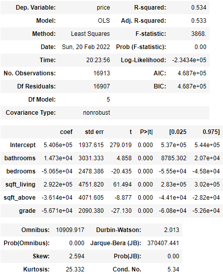
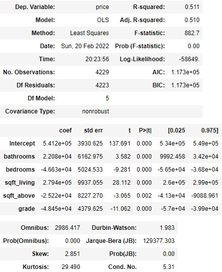
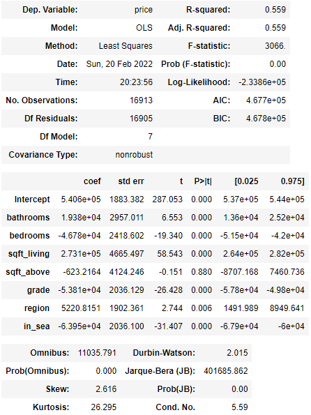
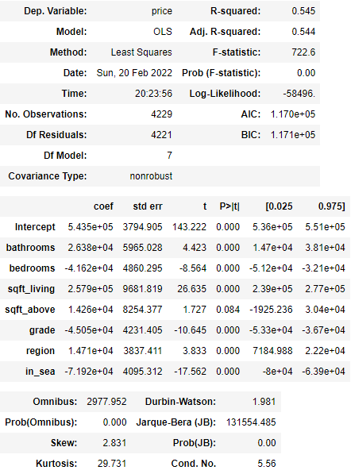
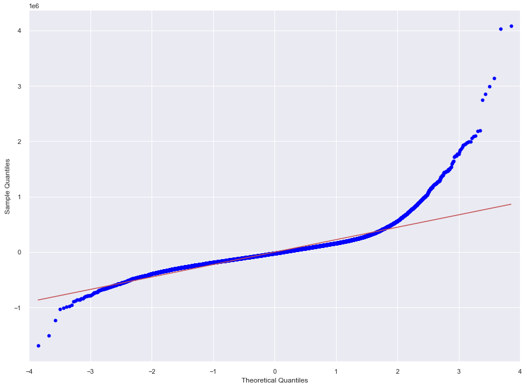
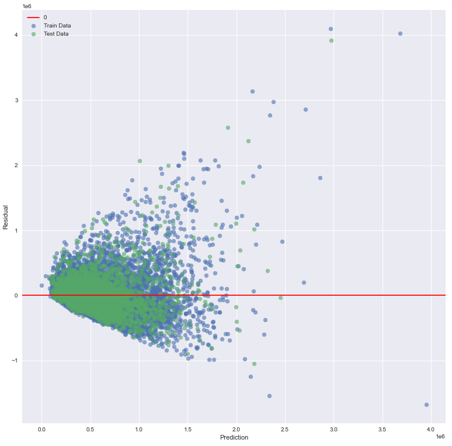
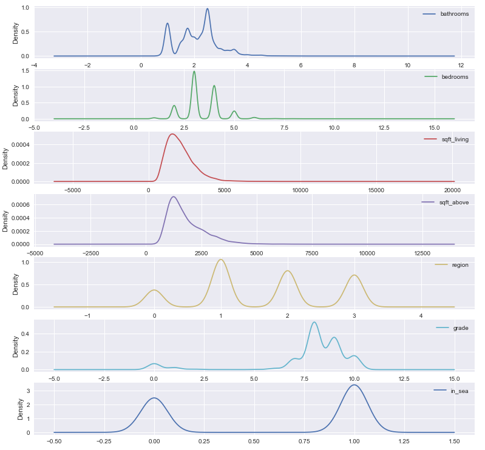

# Analyzing King County Real Estate

-Student Names: Chris Helmerson, Tim Cleary, 'Timi Adejumo

## Overview

We have been contracted by a building company, Flatiron Construction Co., newly located in King County, WA. They want to enter the housing market and are unsure of which features of a new house are most important when looking to build and sell. We have been asked to source relevant data and provide the needed information.


---

### **Business Understanding**
At the onset, there are a lot of decisions a home builder must make. A home builder's dream is to make homes that tick all of the boxes on the buyer's checklist. However, the question a builder wants answered is exactly what the buyer wants in a home. Our client, Flatiron Construction Co. has given us the opportunity to answer that question as they foray into King County.  Currently, builders are facing major challenges, including escalation of prices of and a shortage of building materials, and labor shortages. On the other hand, the demand for homes has not slowed down. This means builders, like never before, must make the most use of the resources available.

---

### **Data Understanding and Analysis**
We sourced our data majorly off the King County Homes sales dataset, which is widely and openly available on the Internet. We were also able to source some additional data from the 
Capitol Impact Government Gateway website. The dataset is for house sales in King County, WA between the the years 2014 to 2015. The dataset is available in .csv
format. 
To analyse the data, we made use of the following Python libraries:
-Numpy v1.20.3, Pandas 1.1.3, Matplotlib 3.3.1, Statsmodel 0.12.0, Scipy 1.5.2, and Seaborn 0.11.0.

The following information pertaining to home sales is available readily on the datasets: 
date and price of sale of the home, location of the property (zipcode and longitudinal and latitudinal coordinates), size (in square ft) of each property, age, condition and number of bathrooms and bedrooms.


---

### **Data Preparation:**
The King County Home sales dataset we worked with required cleaning in its raw state. It had 21 columns, and the 3 datatypes: integer, strings and floats. 
Some of the columns were also categorical in nature. 
* **Datatype conversion:**
    To better work with some of the columns, we had to cast them to other datatypes, for instance: 'sqft-basement' from string to float, 'date' column from string to datetime format, etc.
* **Missing Values:**
    We had to deal with null values in our dataset. Three columns had null values. Due to the relatively small number of null values we were able to apply modal imputation where     needed to fill in the missing information. 
* **Categorical data:**
     Next we looked to get some of our data into numerical categories using OneHotEncoding and Ordinalencoding to work better (or at all) with our model. 
* **Outliers:**
     There was only a solitary case of outliers probably due to clerical errors. 
* **Scaling:**
     Before fitting the training data, we scaled the train and test data using the StandardScaler.

---

### **Modeling**
Among all of the included features, bathrooms, bedrooms, sqft_living (size of the living area), sqft_above(size of the above ground footage), and grade made the most sense to select for our stakeholder. They showed some level of multicollinearity with our price, and were also good choices when thinking about building a new home. The size of the house, where it is located, the ammenities etc. will determine the price of a house.


Our first model accounted for 53% of the total variance in price, as per our selected variables. We decided to use these because they had a combination of being relevant to a developer and showing moderate relation to the price. We first ran our base model:

### Base Model on our train data



### Base Model on our test data



This worked out pretty well, but we also want to run our model with the features that we engineered. In order to account for some untold information we created two features for our model. We binned our zipcodes into regions and sorted by them, and then also added an indicator whether a house is inside Seattle city limits or not. These allowed us to examine physical location as an variable in a more tangible way than latitude or longitude.


---
### Advanced Model on our train data



### Advanced Model on our test data



With our improved model shown above, we had an R-squared value of 56%. This is a significant improvement over our previous model! This means that location and whether or not a house is inside Seattle is important enough to pay attention to when building a new home. 

---
### **Validation**

In order to validate our findings, we ran several tests to check for normality.



Our lines are very close or touching on most of the qqplot which indicates normality.



Next we tested for heteroskasticity, which measures error by plotting with real and with predicted data. While there does appear to be minor trending towards the bottom left, it has a typical shape for this sort of test. Additionally there seem to be plenty of scattered points which is exactly what we like.



Finally we ran a KDE plot for each of our features individually to check for normal distribution. Our two numeric categories (sqft_living and sqft_above) have very normal curves. Our other data is categorical, and while it may seem like the data is off remember this: They can only belong to one category at a time. If there are two or more curves on a particular column that is why. Among our categories is more normally distributed data, further backing up our model.


Based on our findings we recommend that you take a look at features like number of bathrooms, the square footage inside the house, as well as location and region and more. We believe that all of these can be significant for your company's decisions moving forward in order to maximize margins.

---

### **Conclusion**


---

### **Going Forward**
Based on our current model we feel that there is tremendous room for growth. Given more time we would love to look at features like proximity to shopping centers, or even to the beach!

---

### **Repository Structure**
```
.
├── Data                                       <- Contains our dataframe as well as the photos used in this README
├── .gitignore                                 <- Ignore file to hide sensitive or unnecessary files from being involved
├── FINAL_NOTEBOOK.ipynb                       <- The final iteration of our notebook on this project
├── Phase 2 Contract (Timi, Chris, Tim).docx   <- Our group's contract
├── README.md                                  <- This file! The summation of our presentation.
└── presentation.pdf                           <- PDF of our slide deck for our presentation
```
